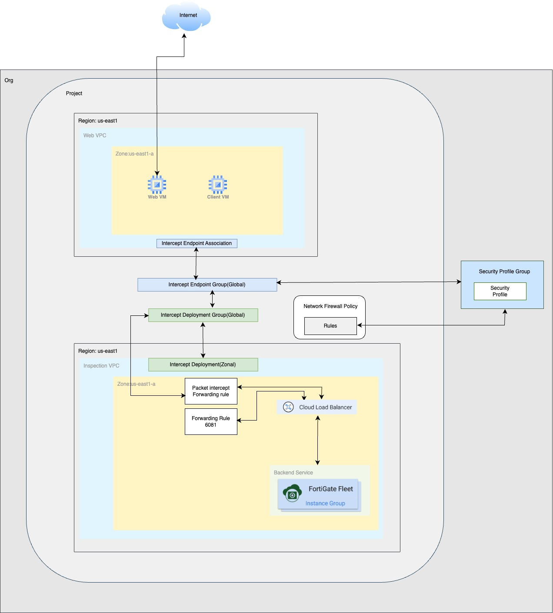
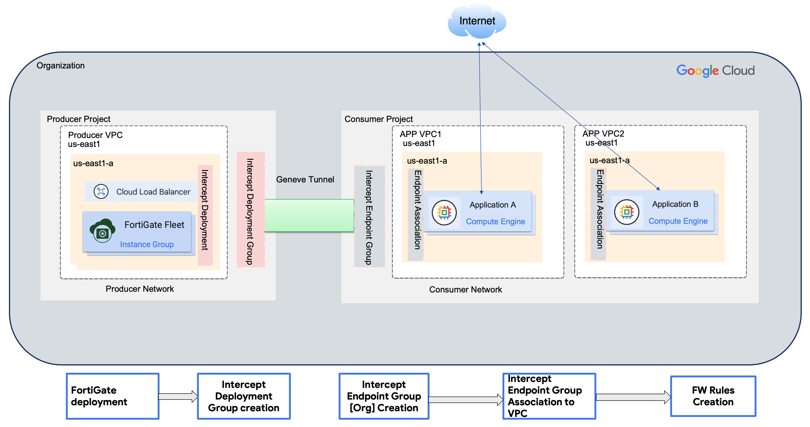
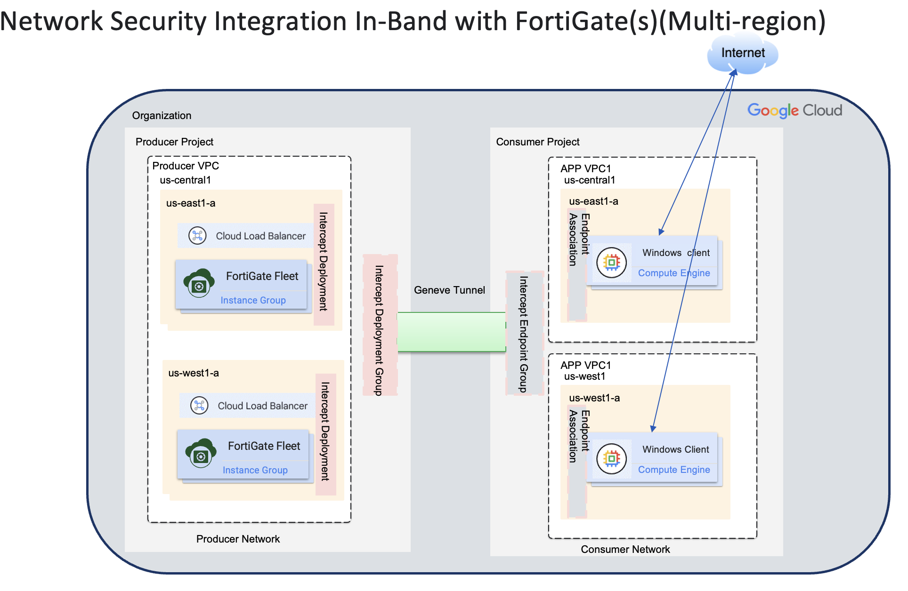

# Network Security Integration In-band Deployment with FortiGate-VM


> [!CAUTION]
> **Disclaimer**<br/>
> **Fortinet Confidential Internal Use Only**
> This document contains confidential information that is proprietary to Fortinet Inc. No part of its contents may be used, copied, disclosed or conveyed to any party in any manner whatsoever without prior written permission from Fortinet Inc.<br/>
> Copyright © 2025, Fortinet Inc. All rights reserved.


## Summary
Google Cloud introduced a set of features called Network Security Integration(NSI) in 2025 which will be used to integrate with network security appliances like ForitGate(s) in a seamless and transparent way. NSI uses GENEVE protocol to communicate with Next Generation firewalls FortiGates. NSI consists of two deployment methods namely 
NSI out-of-band Deployment and NSI In-band Integration. This article is focused on NSI In band Integration. 

NSI operates in a Producer- Consumer Model where the FortiGates are deployed in the producer infrastructure and exposed as a service for the consumers to subscribe to the service.  The consumer after subscribing to the Producer's service  uses firewall policies to route the traffic for inspection for the application traffic as they see fit. The delineation helps the customer to achieve consistent security posture across multiple workloads across VPCs/projects in the same Organization.

The following diragem outlines how different components of Google cloud is integrated with FortiGate(s) for this architecture.




# NSI (Network Security Inspection) - In-Band Deployment

This repository contains Terraform infrastructure code for deploying a complete NSI (Network Security Inspection) solution using FortiGate security appliances in Google Cloud Platform (GCP).


The following  diagram outlines the steps to integrate FortiGate(s) with Google NSI In-Band 




## 🏗️ Architecture Overview

The NSI deployment creates a comprehensive security inspection solution with:
- **FortiGate Security Appliances**: Multi-region deployment with auto-scaling
- **Network Security Policies**: Advanced threat detection and prevention
- **Load Balancing**: High availability across multiple zones
- **Bootstrap Configuration**: Automated FortiGate setup with NSI-specific policies


## 📋 Prerequisites

- **Terraform**: Version 1.0 or higher
- **Google Cloud SDK**: Authenticated with appropriate permissions
- **GCP Project**: With billing enabled and necessary APIs activated
- **Organization Access**: Required for network security policies

### Required GCP APIs
```bash
gcloud services enable compute.googleapis.com
gcloud services enable networksecurity.googleapis.com
gcloud services enable cloudresourcemanager.googleapis.com
```

## 🚀 Quick Start

### 1. Clone and Configure
```bash
git clone <repository-url>
cd NSI_Inband
```

### 2. Set Required Variables
Edit `terraform.tfvars`:
```hcl
prefix = "your-deployment-name"
project_id = "your-gcp-project-id"
organization_id = "your-org-id"
```

### 3. Deploy Infrastructure
```bash
terraform init
terraform plan
terraform apply
```


## 🔧 Configuration

### Core Variables

| Variable | Description | Default | Required |
|----------|-------------|---------|----------|
| `prefix` | Resource name prefix | `demofgt-nsi` | ✅ |
| `project_id` | GCP project ID | `praveen-pi2` | ✅ |
| `organization_id` | GCP organization ID | - | ✅ |
| `fortigate_version` | FortiOS version | `7.6.2` | ❌ |
| `admin_password` | FortiGate admin password | `Admin123!` | ❌ |


### Multi-Region Deployment

Default regions and zones:
```hcl
instance_templates = {
  "west-template" = {
    region = "us-west1"
    data_subnet_name = "west"
    mgmt_subnet_name = "mgmt-west"
  }
  "central-template" = {
    region = "us-central1"
    data_subnet_name = "central"
    mgmt_subnet_name = "mgmt-central"
  }
}
```

> **Note:** The regions that are used for this document are us-west1 and us-central1 and a network block diagram is shown below. 




## 📈 Outputs

After deployment, the following outputs are available:

| Output | Description |
|--------|-------------|
| `load_balancer_ips` | Frontend IP addresses |
| `instance_template_names` | Created template names |
| `intercept_deployment_group_name` | NSI deployment group |
| `security_profile_group_name` | Applied security profiles |

## 🛠️ Operations

### Viewing Instance Status
```bash
gcloud compute instances list --filter="name~'demofgt-nsi'"
```

### Accessing FortiGate
```bash
# Get external IP
gcloud compute instances describe INSTANCE_NAME --zone=ZONE --format="get(networkInterfaces[0].accessConfigs[0].natIP)"

# Access via HTTPS
https://EXTERNAL_IP
```

### Checking Logs
```bash
# Firewall logs
gcloud logging read "resource.type=gce_firewall_rule"

# Instance serial console
gcloud compute instances get-serial-port-output INSTANCE_NAME --zone=ZONE
```
## 🛡️ Security Features


### Network Security Policies
- **Ingress/Egress Rules**: With logging enabled
- **Security Profile Groups**: Custom NSI profile groups 
- **Intercept Deployments**: Traffic redirection to security appliances

### High Availability
- **Multi-Zone Deployment**: Instances across availability zones
- **Health Checks**: Automated instance health monitoring

## 📊 Monitoring and Logging

### Enabled Logging
- **Firewall Policy Logs**: All traffic inspection events
- **Load Balancer Logs**: Health check and traffic distribution
- **FortiGate Logs**: Security events and policy enforcement

### Health Checks
- **HTTP Probe**: Port 8008 for instance health
- **Backend Health**: Load balancer backend monitoring
- **Console Access**: Serial console for troubleshooting

## 🔄 Bootstrap Configuration

The `bootstrap/bootstrap.conf` template automatically configures:
- **System Settings**: Hostname, admin credentials, timezone
- **Network Interfaces**: Data, management, and Geneve tunnels
- **Security Policies**: NSI-specific inspection rules
- **Routing**: Static routes and policy-based routing
- **Health Monitoring**: Probe response configuration


## 🔍 Troubleshooting

### Common Issues

1. **Instance Boot Failures**
   - Check serial console logs
   - Verify bootstrap configuration
   - Ensure proper licensing

2. **Health Check Failures**
   - Verify probe response configuration
   - Check firewall rules
   - Validate load balancer settings

3. **Network Connectivity**
   - Verify routing tables
   - Check security policies
   - Validate intercept configurations

### Debugging Commands
```bash
# Check terraform state
terraform show

# Validate configuration
terraform validate

# Plan changes
terraform plan
```

## 🗑️ Terraform Destroy

When you need to tear down the NSI infrastructure, follow these steps carefully to ensure clean resource removal.

### ⚠️ Pre-Destroy Checklist

Before destroying the infrastructure, ensure:
- [ ] All critical data is backed up
- [ ] No production traffic is flowing through the security appliances
- [ ] Consumer VPCs are disconnected from security policies
- [ ] All dependent resources are identified

### Destroy Process

#### 1. Plan the Destruction
```bash
# Review what will be destroyed
terraform plan -destroy
```

#### 2. Execute Destroy
```bash
# Destroy all resources
terraform destroy

# Or use auto-approve for non-interactive mode
terraform destroy -auto-approve
```


## 📄 License

This project is licensed under the MIT License - see the LICENSE file for details.


**Note**: This deployment creates billable GCP resources. Monitor costs and clean up resources when no longer needed.
